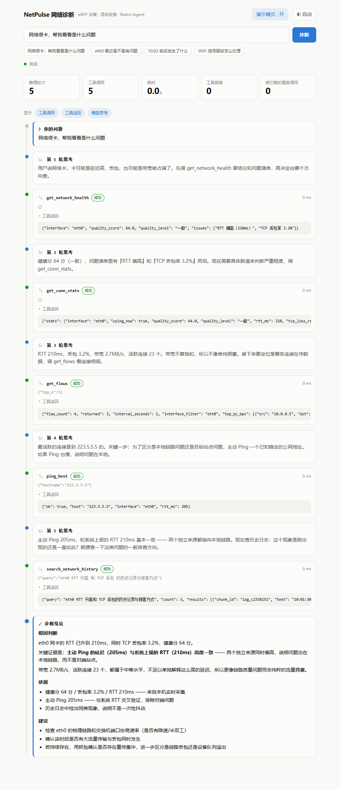
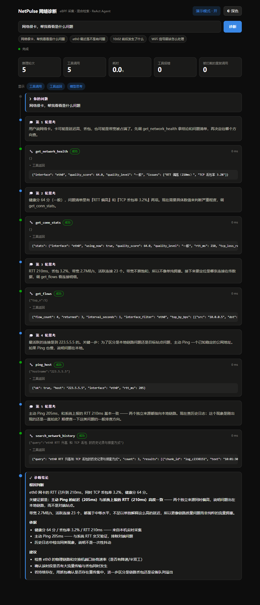

# NetPulse — eBPF 内核级网络监控 + LLM 诊断 Agent

> 传统网络监控工具只呈现指标、不下结论，根因靠人判断。
> 这个项目在 eBPF 内核态采集之上构建 LLM Agent，
> 让用户用一句自然语言描述问题，系统自己动手查、自己编排排查路径、给出根因判断。



> 📖 **第一次跑这个项目，先看 [`How To Use.txt`](如何使用.txt)** ——
> 完整的启动流程、虚拟环境用法、以及所有踩过的坑和报错速查。
> 本 README 讲的是"这个项目是什么、难点在哪"，那份文档讲的是"怎么让它跑起来"。

---

## 一、它能做什么

```
用户 > 网络很卡，帮我看看是什么问题

[第 1 轮] 卡可能是延迟高、丢包，也可能是带宽被占满了。
         先拿健康分和问题清单，再决定往哪个方向查。
  🔧 get_network_health        64 分 / RTT 偏高 / 丢包 3.2%
[第 2 轮] 需要具体数值判断严重程度。
  🔧 get_conn_stats            RTT 210ms / 丢包 3.2% / 带宽 2.7MB/s
[第 3 轮] 带宽不算饱和，不像单纯拥塞。要定位是哪条连接在传数据。
  🔧 get_flows                 10.0.0.5:51422 → 223.5.5.5:443
[第 4 轮] 为了区分"本地链路问题"和"目标站点问题"，主动 Ping 验证。
  🔧 ping_host                 223.5.5.5 → 205ms
[第 5 轮] 主动 Ping 和系统 RTT 都偏高 —— 两个独立来源指向本地。查历史。
  🔧 search_network_history    历史日志显示同类现象此前出现过

## 根因判断
eth0 的 RTT 升到 210ms、丢包 3.2%。关键证据是主动 Ping（205ms）与
系统上报的 RTT（210ms）高度一致 —— 两个独立来源同时偏高，
说明问题在本地链路，而不是对端站点。
带宽 2.7MB/s 属中等负载，不足以解释这么高的延迟。

## 建议
1. 检查 eth0 物理链路与交换机端口协商速率
2. 确认该时段是否有大流量与丢包同时发生
```

**上面每一轮的"思考"都是模型自己写的**，不是脚本。这就是 ReAct 的意义 ——
你能看到它为什么决定调这个工具，而不是只拿到一个黑盒结论。

| | 传统监控工具 | NetPulse |
|---|---|---|
| 输入 | 看仪表盘，自己找异常 | 一句话描述问题 |
| 排查路径 | 人决定查什么 | 模型自己决定，多步迭代 |
| 输出 | 指标数值 | 根因判断 + 依据 + 建议 |
| 记忆 | 无 | 记住历次诊断，下次能"想起" |

---

## 二、30 秒看效果（不需要任何配置）

```bash
cd agent
python main.py --dry-run
```

用假模型 + 假工具把完整推理链演一遍 —— **不用 API Key、不用起 C++ 服务、不用建索引**。

想要可视化界面：

```bash
cd web
pip install -r requirements.txt -i https://mirrors.aliyun.com/pypi/simple/
uvicorn app:app --port 8000
```

打开 <http://127.0.0.1:8000>，点**演示模式**，再点一个示例问题。

深色模式：



界面上能实时看到每一轮思考、每次工具调用的参数和原始返回（可展开）、最终结论。
顶部的 **「被拦截的重复调用」** 不是 0 的时候，说明容错机制正在工作。

---

## 三、完整部署

### 环境要求

| 操作系统 | **Linux**（WSL2 可用）。eBPF 和 D-Bus 都只有 Linux 有 |
| Python | 3.10+ |
| 权限 | root（eBPF 和原始套接字需要） |
| 百炼 API Key | 可选。没有也能跑采集和检索，只是没有自然语言结论 |

> Windows 用户请用 WSL2，并把项目放在 WSL 的文件系统里（如 `~/netpulse`）
> 而不是 `/mnt/e/...` —— 跨文件系统 IO 慢很多，D-Bus 在跨系统场景下也偶发连不上。

### 步骤

```bash
# 1. 编译 C++ 服务
sudo apt-get install -y build-essential clang llvm pkg-config \
  libdbus-1-dev libglog-dev libelf-dev zlib1g-dev libcap-dev \
  linux-headers-$(uname -r) libbpf-dev
make

# 2. 启动服务（-E 不能省，见下方"排查"第一条）
sudo -E ./server/bin/weaknet-dbus-server

# 3. 装 Python 依赖
pip install -r rag/requirements.txt -i https://mirrors.aliyun.com/pypi/simple/
pip install -r agent/requirements.txt -i https://mirrors.aliyun.com/pypi/simple/
pip install -r web/requirements.txt -i https://mirrors.aliyun.com/pypi/simple/
sudo apt install python3-dbus

# 4. 建检索索引
cd rag && python build_index.py --sample

# 5. 配 Key（可选）
export QWEN_API_KEY='sk-你的百炼key'

# 6. 跑
cd ../agent && python main.py -q "网络很卡，帮我看看"
```

四条外部依赖**缺任何一条都不会让程序崩** —— 对应的工具返回错误，模型看得到并会绕开。
这是有意的降级设计。启动时会自动检查并提示。

### 怎么用 Agent

```bash
cd agent

python main.py                          # 交互模式（多轮，带记忆）
python main.py -q "网络很卡"             # 单次提问
python main.py --dry-run                # 离线演示，不需要任何配置
python main.py --list-tools             # 看 7 个工具和它们的 schema
python main.py --json -q "..."          # 输出完整推理轨迹 JSON

python main.py --memories               # 它记住了什么
python main.py --forget mem_abc123      # 删掉某条记忆
python main.py --no-memory -q "..."     # 本次不读写记忆
```

交互模式下多轮共享上下文，所以第二句问"那 wlan0 呢"它能听懂 ——
这是单次提问（`-q`）和交互模式的区别。

其他入口见各目录的 README：`rag/` `agent/` `mcp_server/` `web/`。

---

## 四、架构

```
                    ┌─────────────────────────────────────┐
   用户一句话  ───►  │  Agent 层（agent/）                  │
                    │  手写 ReAct 循环 · 7 个工具           │
                    │  三层记忆 · 五种容错                  │
                    └───┬──────────────────────┬──────────┘
                        │ 实时数据              │ 历史与经验
                        ▼                      ▼
            ┌───────────────────┐   ┌────────────────────────┐
            │ 采集层             │   │ 检索层（rag/）          │
            │ server/ client/    │   │ FAISS 向量 + BM25 稀疏  │
            │ C++17 · eBPF kprobe│   │ RRF 融合 + Rerank 重排  │
            │ D-Bus 接口 + 事件   │   └────────────────────────┘
            └───────────────────┘
                        │
                        ▼
            ┌───────────────────────────────────────────────┐
            │ 对外接入口                                     │
            │ mcp_server/  → MCP 客户端（Claude Code/Desktop）│
            │ web/         → 浏览器（FastAPI + SSE 可视化）   │
            └───────────────────────────────────────────────┘
```

| 目录 | 是什么 | 技术栈 | 规模 |
| `server/` `client/` | 内核态采集 + D-Bus 服务 | C++17 / eBPF / libbpf / D-Bus | — |
| `rag/` | 混合检索 + Rerank | Python / FAISS / jieba / 百炼 | 3.0k 行 |
| `agent/` | ReAct 循环 + 工具 + 记忆 | Python / Anthropic 协议 | 5.1k 行 |
| `mcp_server/` | MCP 协议接入 | Python / mcp SDK | 1.3k 行 |
| `web/` | Web 服务 + 可视化 | Python / FastAPI / SSE | 1.2k 行 |

**工具定义只在 `agent/tools.py` 里有一份**，MCP 层和 Web 层都只是渲染/转发它。

---

## 五、核心难点

### ① 一个 API Key，三个不同协议的端点

百炼的一个 Key 要打三种协议 —— 生成走 Anthropic Messages、向量化走 OpenAI 兼容、
重排走 DashScope 原生。三者请求体形状完全不同（Anthropic 的 `system` 是顶层参数、
`max_tokens` 必填；DashScope rerank 是嵌套的 `{"input":{...},"parameters":{...}}`）。

**最容易踩的一脚**：Anthropic 协议里**没有 embedding 接口** ——
Anthropic 官方不提供向量化模型。所以向量化必须换端点，
而这个端点只实现了 `/v1/messages`，**没有 `/v1/models`**，
`base_url` 也不能带 `/v1/` 后缀（会拼成 `/v1/v1/messages` 而 404）。

### ② 自己实现 BM25，然后被分词器坑了三次

日志里全是 `eth0`、`210ms`、`3.2%`、`223.5.5.5` 这种强字面 token。
jieba 对多数字技术词切得没问题，但**IP 地址和时间戳一定会切碎**。
所以我先把它们挖成占位符、分词完再还原。这一步连着踩了三个坑：

| 1 | 所有技术词**全部丢失** | 占位符用了 `\x00`，jieba 把 NUL 当分隔符切碎了 | 索引照样建、检索照样跑，只是 BM25 静默失效 |
| 2 | 时间戳变成裸占位符 | 后面的正则**回头匹配了我刚插入的占位符** | 修完第 1 个才被断言抓到 |
| 3 | 某条 query 在**四种检索模式下全漏** | 文档写 `10:00:30`，用户只说 `10:00`，token 天然对不上 | 单看代码完全合理 |

第 3 个的一般化结论最重要：**查询和文档的时间粒度不对称**。
用户描述总是比数据粗。修法必须在**文档侧**补一个粗粒度索引
（反过来补不出来——查询侧少一个冒号补不出秒）。

第 1 个坑之后我写了**断言式自检**（`python bm25.py`），第 2、3 个就是被它抓出来的。

### ③ 工具定义有第二份，就一定会分叉

MCP 的 SDK 会**从函数类型标注自动生成 JSON Schema**，所以最直观的写法是在
`mcp_server/` 里把工具重新声明一遍。**但那样定义就有两份了**，
而且必然分叉：改了 `agent/tools.py` 的 description，MCP 那边还是旧的。

后果特别隐蔽：**同一个模型走 Agent 和走 MCP 表现不一样**。
而 description 恰恰是 Agent 里最贵的东西 —— 它决定模型什么时候调、和相似工具怎么区分。

解法是**单向桥接**：按 JSON Schema 合成一个 `inspect.Signature` 挂到分发函数上，
让 SDK 读到的签名和 schema 完全一致。并且写了测试**逐字比对**两边的 description，
不一致就失败。

### ④ 上下文裁剪不能破坏 tool_use / tool_result 配对

Agent 循环里最容易写错的一处。Anthropic 协议要求 assistant 的每个 `tool_use`
必须在紧接着的 user 消息里有对应的 `tool_result`，**少一个直接 400**。

所以上下文超长时，唯一安全的做法是**把旧工具结果的内容换成占位符** ——
消息本身、配对关系、`tool_call_id` 全部保留。**删消息是唯一不能做的事。**

这个坑的特征：本地短对话测不出来（没触发裁剪），跑长了才突然开始 400，
而报错信息指向"消息格式错误"，完全看不出跟上下文管理有关。
所以我写了 `check_tool_pairing()` 守这条不变量，测试里拿它做断言。

### ⑤ 同步的 Agent 和异步的 Web 之间那座桥

Agent 循环是**同步阻塞**的，一次诊断 30~60 秒。而 FastAPI 跑在 asyncio 上。

**直接在路由里 `await agent.run()` 会把事件循环卡死** ——
这不是"慢"，是"服务不可用"，连你自己的 SSE 连接都建不起来。

正确做法是把 Agent 扔进工作线程，事件用 `call_soon_threadsafe` 投回事件循环。
**写成直接 `put_nowait` 的话，单线程测试完全正常，只在并发下丢事件** ——
所以专门写了个测试测这条路径。

### ⑥ SSE 断点续传：让 EventSource 的自动重连变成好事

浏览器的 `EventSource` 断线会**自动重连**。如果服务端把事件当成一次性流：

```
连接断了 → 自动重连 → 服务端又跑一次诊断 → 又断 → 又重连 → 无限烧钱
```

所以 Run 保存完整的事件历史，订阅时从 `Last-Event-ID` 续发。
这是 SSE 相比 WebSocket 的一个被低估的优势：**断点续传是协议内置的**。

这也解释了接口为什么是"先 POST 再订阅"而不是一个 GET 拉到底 ——
`EventSource` 只支持 GET，问题文本塞 URL 的话每次重连都会重新发起诊断。

### ⑦ 从内核态到用户态：为什么不用 gRPC

我一开始以为 "Python 调 C++ 要用 gRPC"。**但那是针对两个互不相识的进程的通用答案。**
这个场景里 C++ 服务端早就把接口开好了 —— 它注册了 D-Bus 对象，暴露了 5 个方法。

走 gRPC 要写 `.proto` → 改 C++ 构建 → 实现 service → 起 HTTP/2 线程 → 写 Python stub，
两三天换来一个已经拥有的能力。而 D-Bus 是**一行 Python 都不用改**就能用的。

跨语言调用的正确优先级：**已有的接口直接用 > ctypes 加载 .so > 子进程调 CLI > 才轮到 gRPC**。

> 但 D-Bus 有个自己的坑：服务端读 eBPF 需要 root，而客户端和服务端必须挂在
> **同一个 session bus** 上。`sudo` 默认会丢掉 `DBUS_SESSION_BUS_ADDRESS`，
> 于是两边互相看不见，报 `ServiceUnknown`。用 `sudo -E` 解决。
> 这个错误信息完全指不到权限问题，是排查花了最久的一条。

### ⑧ 记忆的两个坑

**坑一：占位文本被当成结论存进了长期记忆。**
模型没给出结论时 `run()` 会把 answer 填成 `"（模型没有给出结论）"` ——
**它是非空字符串**，`if answer:` 挡不住，于是被当成结论记住，
之后每次召回都捞出一条纯噪声。
修法不是做字符串匹配（改一次文案就失效），而是在 `Diagnosis` 上显式加
`answer_is_model_output` 标记。**"非空"和"有意义"是两回事。**

**坑二：跑一次测试就往真实记忆库塞了 7 条假诊断。**
更麻烦的是假诊断里有真实的网卡名和数值，**看起来还挺像真的**。
修法是测试统一走包装函数默认关掉记忆，要测记忆的用临时目录。

---

## 六、测试

```bash
cd rag           && python bm25.py && python eval_recall.py --offline
cd ../agent      && python test_agent.py            # 144 项
cd ../mcp_server && python test_server.py && python test_e2e_stdio.py
cd ../web        && python test_api.py              # 54 项
cd ../web        && python _screenshot.py           # 真浏览器渲染检查
```

**全部不需要 API Key。** 端到端测试用假模型 + 假工具，在任何机器上都能跑通。

### 检索效果（实测）

```
方案                Recall@5   Hit@5    MRR
仅 BM25（稀疏）        0.900    0.900   0.600
仅向量（稠密）         1.000    1.000   0.683
混合 · RRF 融合       1.000    1.000   0.708   +18.1%
```

⚠️ **这组数字只能证明链路通了，不能证明混合检索有用。** 因为离线用的是哈希伪向量，
本质是"戴了向量帽子的 BM25"，两条路径在它眼里高度重合。
真正的收益是 MRR 0.600 → 0.708（排序质量）。换成真 embedding 后 Recall 的差距才会出现。

> 面试里主动说出"我这组实验的局限在哪"，比报一个一追问就塌的漂亮数字可信得多。

### 测试策略

| 文件 | 测什么 | 为什么单独测 |
|---|---|---|
| `agent/test_agent.py` | 循环的**五种边界** | 真模型是不确定的，同一句话跑两次结果不同，没法写断言。所以把模型抽象成接口，测试里注入按剧本返回的假模型 |
| `agent/test_tools.py` | D-Bus **接线** | 失败原因是环境问题，不是逻辑问题 —— 和上面混在一起会让排查更慢 |
| `mcp_server/test_e2e_stdio.py` | 真子进程 + 真客户端 | 进程内测试绕过了整条传输层，验证不了握手、JSON-RPC 编解码 |
| `web/_screenshot.py` | 真浏览器渲染 | 语法检查发现不了"页面上画了 5 轮思考、KPI 却显示 0"这类 bug |

最后一条抓到过真 bug：KPI 上的"推理轮次"显示 0，而时间线上明明有 5 轮思考 ——
因为计数器加错了变量。`node --check` 和 DOM 结构断言都发现不了它。

---

## 七、排查手册

| 症状 | 原因 | 解法 |
|---|---|---|
| `ServiceUnknown` | `sudo` 丢了 D-Bus 地址 | `sudo -E ./server/bin/weaknet-dbus-server` |
| `GetFlows` 报 UnknownMethod | 服务端是旧版本 | 重新 `make` 并重启 |
| `search_network_history` 报错 | 索引没建 | `cd rag && python build_index.py --sample` |
| 中文显示成问号 | Windows 控制台编码 | 设 `PYTHONIOENCODING=utf-8` |
| 模型报 400 | 模型名/Key 类型/base_url 有 `*/v1` | 见 `agent/llm_client.py` 里分点列的报错提示 |
| 想知道它为什么这么判断 | — | `python main.py --json -q "..."`，`steps` 里有每一轮的完整轨迹 |

---

## 八、C++ 核心（采集部分）

| 技术 | 用途 |
|---|---|
| eBPF kprobe（`ip_queue_xmit` / `udp_sendmsg`） | 内核态 TCP/UDP 流量采集 |
| LRU_HASHMAP（65536 条） | 五元组 → 字节数 / 包数 / PID |
| ICMP 原始套接字 | RTT 延迟探测 |
| Netlink + `/proc/net/snmp` | TCP 丢包与重传统计 |
| wpa_supplicant | WiFi RSSI |
| D-Bus | 服务端 ↔ 客户端接口 + 6 种事件推送 |
| 7 个并行监控线程 | 定时采集与质量评估 |

---

## 九、目录结构

```
AI-Network-Monitoring-System/
├── server/  client/             # C++ 采集 + D-Bus 服务
│   ├── src/flow_rate.bpf.c      # ★ eBPF 内核探针
│   └── src/dbus_service.cpp     # D-Bus 方法（含 GetFlows）
├── rag/                         # ★ 检索层
│   ├── bm25.py                  # 自己实现的 BM25（含分词三个坑的修复）
│   ├── hybrid.py                # RRF 融合
│   └── eval_recall.py           # 检索质量评测
├── agent/                       # ★ Agent 层
│   ├── main.py                  # 命令行入口
│   ├── agent.py                 # ReAct 循环 + 容错
│   ├── tools.py                 # 7 个工具（唯一事实源）
│   ├── memory.py / session.py   # 长期记忆 / 会话记忆
│   └── measure.py               # 测"平均调用几个工具"（简历要用的数）
├── mcp_server/                  # ★ MCP 协议接入
├── web/                         # ★ Web 服务 + 可视化
│   ├── app.py / runstore.py     # FastAPI + 线程→异步的事件桥
│   └── static/index.html        # 单页前端，零外部依赖
├── docs/                        # README 用的截图
├── AI-assisted analysis_old/    # 知识库数据源（勿删，见 rag/knowledge.py）
└── logs/  read/
```

---

## 十、已知缺口

写在简历和 README 里不只是为了诚实，也是为了**面试被追问时不会翻车**。

| 缺口 | 现状 |
|---|---|
| **抓包功能** | 没做。需要新写 C++ 抓包模块 |
| **GetFlows 的 C++ 部分** | 写了，但**没在 Linux 上真正编译验证过**（开发机是 Windows）。做过桩测试验证语法和 JSON 结构 |
| **Web 无鉴权** | 默认只绑 `127.0.0.1`。**不要直接暴露公网** —— 任何人都能消耗你的 API 额度、读日志 |
| **Docker 镜像未构建验证** | Docker daemon 未运行，只做了静态校验（compose 配置合法、COPY 路径存在、.dockerignore 不误伤） |
| **检索评测样本量小** | 38 chunk / 10 query，数字有指示性但**没有统计显著性** |
| **AI 部分是付费的** | 百炼按 token 计费。用 `--dry-run` 可以零成本调试 |

### 简历上这几处必须和代码对齐

| 原话 | 问题 | 已改成 |
|---|---|---|
| "8 个可调用工具" | 实际 7 个（丢包率/WiFi/健康分来自同一次采集），且**抓包没做** | "7 个可调用工具（…日志与知识库混合检索、历史诊断记忆召回）" |
| "LRU_HASHMAP 支持五元组、RTT、重传次数采集" | RTT 和重传**不在那张表里**，是按网卡聚合的 | "…五元组与流量采集；RTT 与重传次数按网卡维度从 ICMP 探测和 Netlink 统计中获取" |
| "单次诊断平均调用 4.2 个工具" | 这个数没有出处 | "通常调用 4~6 个工具"，并用 `agent/measure.py` 量出真实值替换 |

---

## License

MIT
